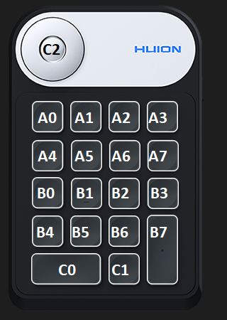

# HuionKeydialSuite

This is custom driver suite for Huion KD100 keydial keyboard (https://store.huion.com/products/mini-keydial-kd100). I buy this device to speed-up coding and have shortcuts for IDE actions. 
However, drivers from manufacturer allow only to set simple keystroke (like "ctrl+s") - I need to send more advanced keystrokes (like "ctrl+k+d; ctrl+k+e; ctrl+s" on one click on keydial).

This is why I decided to build something custom.

This code is depending on virtual hid driver from tetherscript (https://github.com/tetherscript/hvdk) and genuine Huion low-level drivers.

# Getting started

* install HVDK drivers from tetherscript website (https://tetherscript.com/hid-driver-kit-download/)
* install Huion drivers form Huion website
* build code
* install windows service (InstallUtil HuionKeydialSuite.WindowsService.exe)
* configure key mappings in mapConfig.xml
* run windows service
* enjoy :)

# Key map config

Config is done via mapConfig.xml xml file. Windows service is loading this file only once, on start, so when you change mapping during service run, you need to restart windows service. 
Can be improved, but for me is enought.

Sample XML configuration - self descriptive:

```xml
<?xml version="1.0" encoding="utf-8"?>
<HuionMap xmlns:xsi="http://www.w3.org/2001/XMLSchema-instance" xmlns:xsd="http://www.w3.org/2001/XMLSchema">
	<Items>
		<HuionMapItem>
			<Key>A0</Key>
			<Type>Keyboard</Type>
			<Keystroke>
				<string>[LCTRL]+k+d</string>
				<string>[LCTRL]+k+e</string>
				<string>[LCTRL]+s</string>
			</Keystroke>
		</HuionMapItem>
		<HuionMapItem>
			<Key>A3</Key>
			<Type>Keyboard</Type>
			<Keystroke>
				<string>[LCTRL]+K1</string>
			</Keystroke>
		</HuionMapItem>
		<HuionMapItem>
			<Key>A4</Key>
			<Type>Keyboard</Type>
			<Keystroke>
				<string>[LCTRL]+r+t</string>
			</Keystroke>
		</HuionMapItem>
	</Items>
</HuionMap>

```

Key layout:



Keys and modifier keys:

```
Modifiers: 

dummy1
[LCTRL]
[LSHIFT]
[LALT]
[LWIN]
[RCTRL]
[RSHIFT]
[RALT]
[RWIN]

Keys: 

dummy1
dummy2
dummy3
dummy4
a
b
c
d
e
f
g
h
i
j
k
l
m
n
o
p
q
r
s
t
u
v
w
x
y
z
1
2
3
4
5
6
7
8
9
0
ENTER
ESCAPE
BACKSPACE
TAB
SPACEBAR
-
=
[
]
\

;
dummy5
`
,
.
/
CAPSLOCK
F1
F2
F3
F4
F5
F6
F7
F8
F9
F10
F11
F12
PRINTSCREEN
SCROLLLOCK
PAUSE
INSERT
HOME
PAGEUP
DELETE
END
PAGEDOWN
RIGHTARROW
LEFTARROW
DOWNARROW
UPARROW
NUMLOCK
K/
K*
K-
K+
KENTER
K1
K2
K3
K4
K5
K6
K7
K8
K9
K0
K.
F13
F14
F15
F16
F17
F18
F19
F20
F21
F22
F23
F24
```
